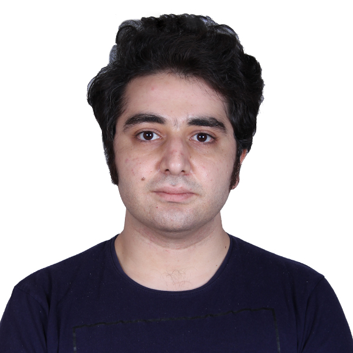

## ALI KIANIAN
#### Tehran-Iran 
#### +989354024978 - ali.kianian1990@gmail.com
##### [Download Resume](alikianian.pdf)

### Personal Information

---
- I’m a C++ developer, working with Qt cross platform.
- Gender: Male
- Married
- Birthday:  07/25/1990
- Mobile: +989354024978
- Email: ali.kianian1990@gmail.com

### EXPERIENCE

---
- *JAN 2016 – PRESENT*

    **SOFTWARE DEVELOPER – SCRUM MASTER**
    
    Developing user interfaces and applications for hardware control using defined protocols.
    Optimizing and translating Matlab codes to C++ in order to have high performance operations.
    Implementing classification algorithms in C++.

- *JUNE 2013 –  MAY 2014*

    **HARDWARE PROGRAMMER, QESHM VOLTAGE**
    
    Designing development boards based on ATMega128 and ARM LPC1768 to control 5DOF robots.
    Working on a vision robot to detect some particular shapes.

### EDUCATION

---
- *2007 - 2012*

    **ROBOTIC ENGINEERING, HAMEDAN UNIVERSITY OF TECHNOLOGY**
    
    Project: Designing a Cansat using ARM LPC2368 and a set of sensors (VGA – Humidity – Temperature – Gyro – GPS) and XBee as communication module.

- *2005* 

    **DIPLOMA, ALLAME AMINI HIGH SCHOOL**

### SKILLS

---
- C++
- ARM uVision
- Proteus
- Altium Design
- Qt Cross platform – Widget application
- Qt – QML
- QCustomPlot
- MVC
- Multi thread application (PThread and concurrent)
- Thread-safe applications 
- Socket programming (TCP – UDP)
- Serial port
- Wireshark
- Database (PostgreSQL – MongoDB – SQL – MySQL)
- Modular programming
- Smart pointers
- Eigen library
- Alglib library

